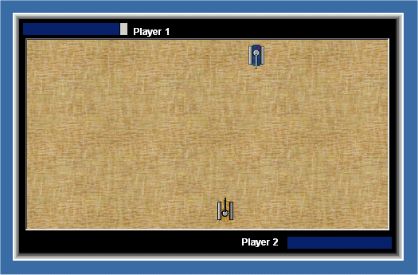



## Rapid Fire

### Description

A horribly un-fun game, written to practice bitblt... Use this code to learn extreme vb6 basics. Do not download if you intend to be entertained.
 
### More Info
 

             |
---                |---
**Submitted On**   |2006-11-25 15:21:00
**By**             |[Keith Van Dyck](https://github.com/Planet-Source-Code/PSCIndex/blob/master/ByAuthor/keith-van-dyck.md)
**Level**          |Beginner
**User Rating**    |5.0 (10 globes from 2 users)
**Compatibility**  |VB 6\.0
**Category**       |[Games](https://github.com/Planet-Source-Code/PSCIndex/blob/master/ByCategory/games__1-38.md)
**World**          |[Visual Basic](https://github.com/Planet-Source-Code/PSCIndex/blob/master/ByWorld/visual-basic.md)
**Archive File**   |[Rapid\_Fire20330211252006\.zip](https://github.com/Planet-Source-Code/keith-van-dyck-rapid-fire__1-67187/archive/master.zip)

